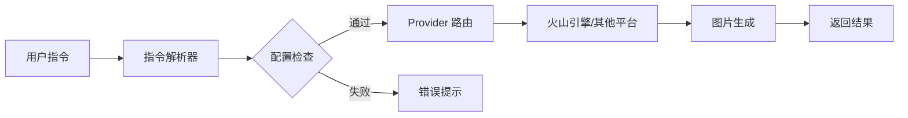

<!-- 顶部动态横幅区域 -->
<div align="center">
  
</div>

<!-- 萌系徽章区域 -->
<div align="center">
  
  
  
  
  
</div>

<!-- 装饰分隔线 -->
<p align="center">
  
</p>

<!-- 功能特性区域 - 卡片式布局 -->
<div align="center">
  
## 功能特性
  
</div>

<table align="center">
<tr>
<td width="50%" valign="top">


<div align="center">
  
`OpenAI 协议兼容`
  
</div>

- 支持所有兼容 OpenAI 接口的 AI 绘图服务
- 轻松接入，无缝切换不同平台

</td>
<td width="50%" valign="top">

<div align="center">
  
`开箱即用 · 丝滑流畅`
  
</div>

- **简单配置启动**: 简单配置即可开始创作
- **LLM 智能集成**: 完美接入 AstrBot Agent，对话中自然生图
- **中文指令支持**: `/画画` 

</td>
</tr>
<tr>
<td width="50%" valign="top">


<div align="center">
  
`开发友好`
  
</div>

- **Provider 架构**: 模块化设计，扩展无忧
- **异步高性能**: 基于 `aiohttp`，运行丝滑不卡顿

</td>
<td width="50%" valign="top">

<div align="center">
  
`持续进化中`
  
</div>

- 模型自适应分辨率 *(开发中)*
- 智能缓存清理 *(开发中)*

</td>
</tr>
</table>

<!-- 快速开始区域 -->
<div align="center">

## 快速开始

</div>

### 安装

```bash
# 将插件放入 AstrBot 的 plugins 目录即可自动加载
git clone https://github.com/your-repo/astrbot_plugin_nimage.git 
```

### 获取 API Key (推荐火山引擎)

<div align="center">

| 步骤  | 操作                        |                    链接                     |
| :---: | :-------------------------- | :-----------------------------------------: |
|   1   | 访问火山方舟控制台          | [前往](https://console.volcengine.com/ark/) |
|   2   | 开通「图像生成」服务        |                      -                      |
|   3   | 获取 API Key 和 Endpoint ID |                      -                      |

</div>

### 基础配置

在 AstrBot 配置面板中填入：

```json
{
  "api_config": "https://ark.cn-beijing.volces.com/api/v3",
  "token": "你的-API-Key",
  "model": "你的-Model-ID",
  "size": "2K",
  "enable_llm_tool": true
}
```

### 开始使用

<div align="center">

```
/画画 一只在星空下奔跑的独角兽，赛博朋克风格
```

</div>


<!-- 使用指南 -->
<div align="center">

## 使用指南

</div>

### 命令列表

<div align="center">

|  命令   |       格式       |         说明         |       示例       |
| :-----: | :--------------: | :------------------: | :--------------: |
| `/画画` | `/画画 <提示词>` | 使用默认配置生成图片 | `/画画 日落风景` |

</div>

<!-- 配置说明 -->
<div align="center">

## 配置说明

</div>

<div align="center">

|       参数        |  类型  |            说明            |                   默认值                   |
| :---------------: | :----: | :------------------------: | :----------------------------------------: |
|   `api_config`    | string | API 接口地址 (OpenAI 协议) | `https://ark.cn-beijing.volces.com/api/v3` |
|      `token`      | string |        API 访问令牌        |                  `token`                   |
|      `model`      | string |   模型名称或 Endpoint ID   |        `doubao-seedream-4-0-250828`        |
|      `size`       | string |       默认图片分辨率       |                    `2K`                    |
| `enable_llm_tool` |  bool  |   是否启用 LLM 工具集成    |                  `false`                   |

</div>
<!-- 开发者指南 -->
<div align="center">

## 开发者指南

</div>

<div align="center">

### 想要添加新平台？

</div>

```
1. 在 provider/ 目录下创建新的 Provider 实现
2. 在 main.py 中引用并根据配置初始化
3. 完成！
```

<div align="center">

### 核心架构

</div>



<!-- 致谢区域 -->
<div align="center">

## 致谢

</div>

<div align="center">

> 感谢原作者 **[木有知](https://github.com/muyouzhi6/astrbot_plugin_gitee_aiimg)** 开发的初始版本  
> 本插件在其基础上进行了全面重构与优化

<br>


<!-- 底部动态横幅 -->


</div>
